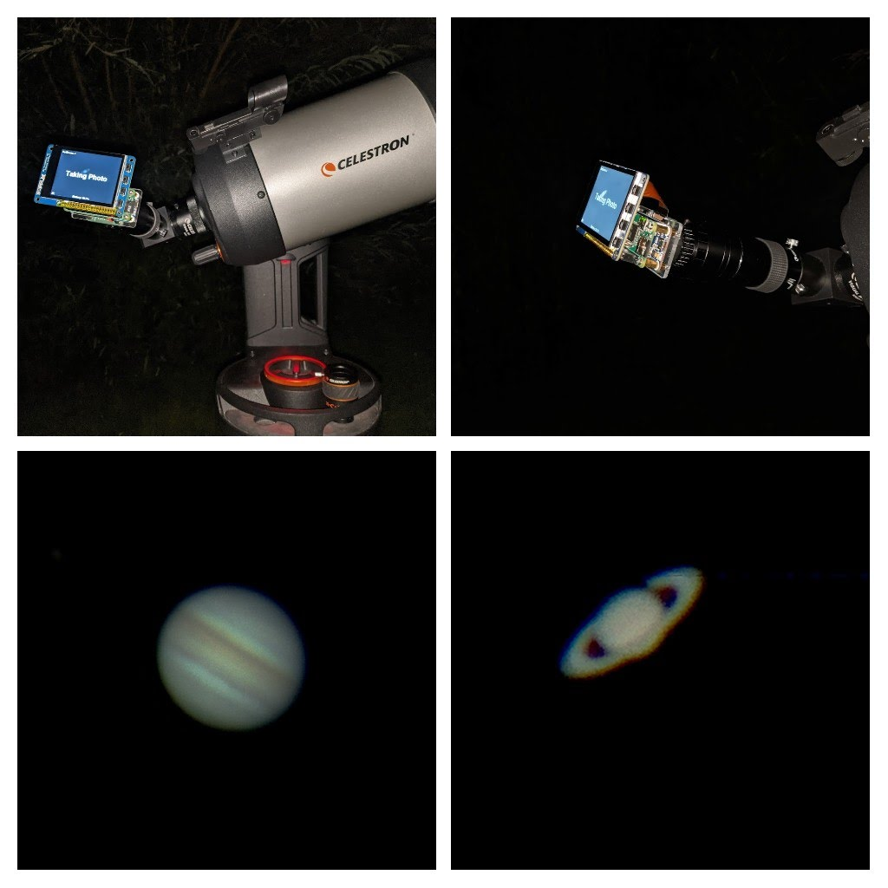

# AstroPiPy

An attempt to capture images from a Telescope using a RaspberryPi Zero and display on a 2.8" Adafruit Capacitive Screen

## Equipment:

* Raspberry Pi Zero
 * Raspbian 10
 * GPU Memory set to	256MB
* Adafruit PiTFT Plus 320x240 2.8" Capactive Screen
  * Specific Installation instructions - https://learn.adafruit.com/adafruit-2-8-pitft-capacitive-touch/easy-install-2#pitft-as-raw-framebuffer-device-2982165-49
* Waveshare UPS Hat
  * https://www.waveshare.com/wiki/UPS_HAT_(C)
  * Code imports example Python to show battery percentage: https://www.waveshare.com/w/upload/4/40/UPS_HAT_C.7z
* Raspberry PI High Quality Camera
  *https://www.raspberrypi.org/products/raspberry-pi-high-quality-camera/

## Running the code

In all the examples below the code is assumed to be in /home/pi/AstroPiPy/, replace this with the location of your code.

The code must me run using sudo to allow the copying of data to the framebuffer, for testing whilst the desktop is running then start with:

sudo python3 /home/pi/AstroPiPy/AstroStream.py

This will start the camera with a capture resolution of 640x480

For use with the telescop use:

sudo python3 /home/pi/AstroPiPy/AstroStream.py HighRes

This starts the camera with a capture resolution of 1660x1232, this is chosen so as to not overload the memory when video capture is underway.

The code can be run on startup of the Raspberry Pi by inserting a line into rc.local.

1. Open terminal
1. Run:
   1. sudo nano /etc/rc.local
1. Add the following towards the end, but before exit 0:
   1. sudo python3 /home/pi/AstroPiPy/AstroStream.py HighRes &

## Optical Equipment used

* Svbony M42x0.75 Extension tube 
  * This is required to move the camera sensor into the focal plane
* Svbony SV163 Telescope Eyepiece
  * This converts from the M42 thread used on the eyepiece to the C Mount on the High Quality Camera
* Celestron Evolution 6
* 40mm lens with ScopeTronix Digi-T
* Celestron Zoom 8-24mm eyepiece 
  * https://www.celestron.com/products/8-24mm-zoom-eyepiece-125in 
  * Features an inbuilt M42 thread

 

